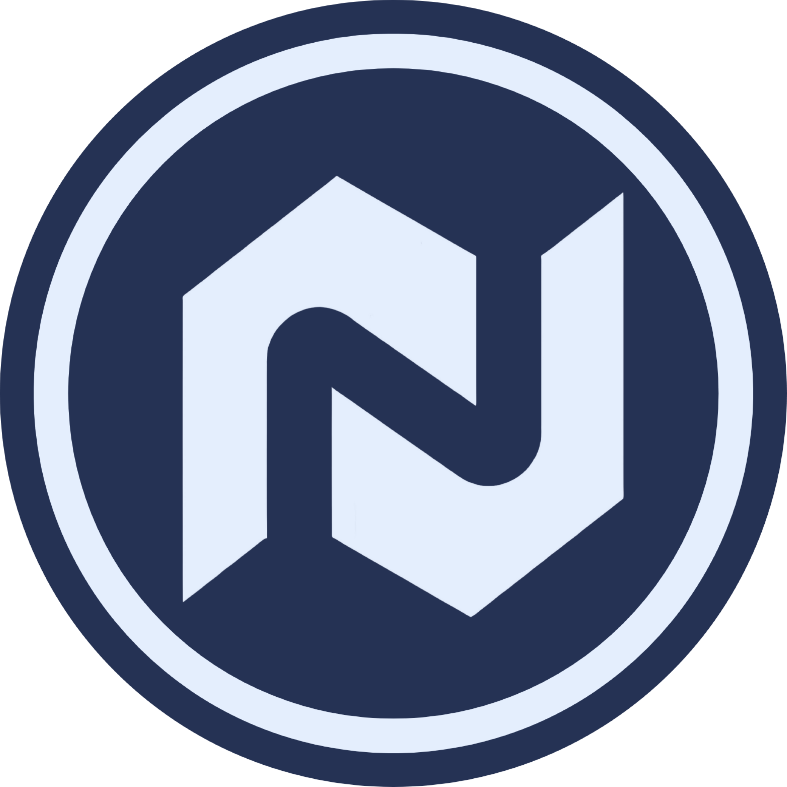

<p align="center"></p>

<h1 align="center">NMC Launcher</h1>


[<p align="center">](https://github.com/NMC-Network/NMCLauncher/releases)

<p align="center">NovaMCへの接続に特化したクライアントサイド・公式カスタムランチャーです。</p>

## Downloads


[](https://github.com/NMC-Network/NMCLauncher/releases/latest)

**Supported System**

| Platform | File |
| -------- | ---- |
| Windows x64 | `Helios-Launcher-setup-VERSION.exe` |
| macOS x64 | `Helios-Launcher-setup-VERSION-x64.dmg` |
| macOS arm64 | `Helios-Launcher-setup-VERSION-arm64.dmg` |
| Linux x64 | `Helios-Launcher-setup-VERSION.AppImage` |

## Console


エラーが発生した場合、コンソールを開くことで内容を確認できる場合があります
```console
Ctrl + Shift + I
```


## Resources


* [Website][website]
* [導入方法][how to install]

何かわからないことがあればDiscordでお問い合わせください

[][discord]


[nodejs]: https://nodejs.org/en/ 'Node.js'
[vscode]: https://code.visualstudio.com/ 'Visual Studio Code'
[mainprocess]: https://electronjs.org/docs/tutorial/application-architecture#main-and-renderer-processes 'Main Process'
[rendererprocess]: https://electronjs.org/docs/tutorial/application-architecture#main-and-renderer-processes 'Renderer Process'
[chromedebugger]: https://marketplace.visualstudio.com/items?itemName=msjsdiag.debugger-for-chrome 'Debugger for Chrome'
[discord]: https://discord.gg/p6TwpsVN6R 'Discord'
[website]: https://novamc.life 'Website'
[how to install]: https://docs.novamc.life/launcher/installation 'How to install'
